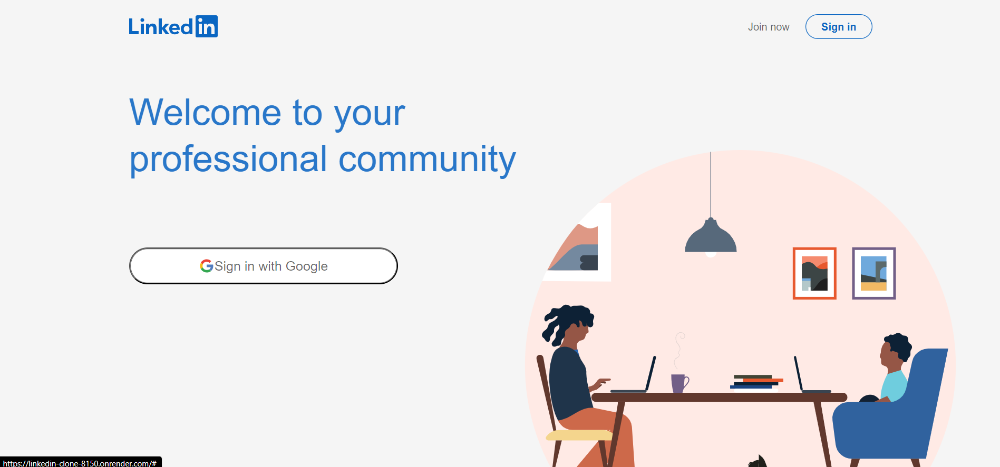
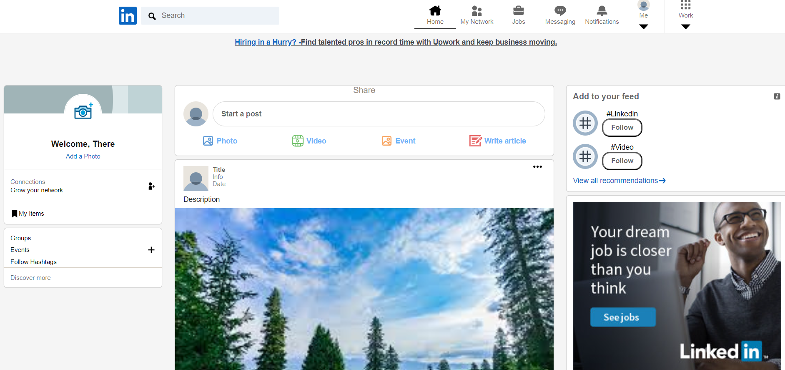

# Linkedin-Clone

A web Application that Duplicates the Linkedin website.

This project is a web application that duplicates linkedin using HTML, CSS, and JavaScript.

Here's a live deployment - https://linkedin-clone-8150.onrender.com/

    

    

## Tech-Stack

- React
- HTML
- CSS
- Styled-Components

## Features

- The application has the overview of the Linkedin web page.
- The application has a login page and a home page that mimics the Linkedin web page.

## Installation and Usage

To install and run this project, you need to have Nodejs installed on your computer.

To download the code for this project, you can clone this GitHub repository using the following command:

`git clone https://github.com/Amritha-07/Linkedin-Clone.git`

To build Dependencies

`npm install`

or

`npm run build`

To start the application

`npm start`

## References

- [Build LinkedIn with React JS (Firebase + Styled Components + Redux)](https://www.youtube.com/watch?v=xP3cxbDUtrc) from Clever Programmer
